# Haven

A calm, premium daily workspace for creators and their small teams. It takes one idea from capture, through footage, versions for each account, editing handoff and review, to posting prep and reuse.

> **Status: Milestone 1 — Haven preview · sample data.** An interactive prototype with a small amount of clearly fictional sample content. No accounts, no database, no uploads, no payments, no platform connections. Every change lives in your browser tab and resets on reload; only your light/dark choice is remembered.

Product and design guidance lives in [`Haven — Design and Claude Build Brief.md`](Haven%20%E2%80%94%20Design%20and%20Claude%20Build%20Brief.md).

## Run it

Requires Node 20+ (Node 22 recommended). In GitHub Codespaces the included dev container installs everything.

```bash
npm install
npm run dev          # http://localhost:5173 — hot-reloading dev server
```

| Command | What it does |
| --- | --- |
| `npm run dev` | Dev server on port 5173 |
| `npm run build` | Typecheck + production build to `dist/` |
| `npm run preview` | Serve the production build on port 4173 |
| `npm run typecheck` | TypeScript only |
| `npm test` | Unit tests (Vitest): demo data integrity, reducer rules, date helpers |
| `npm run test:e2e` | Flow checks (Playwright) on desktop and phone against the build |
| `npm run screenshots` | Regenerates review screenshots in `docs/screenshots/` (both themes, desktop + phone) |
| `npm run check` | typecheck → unit tests → build → flow checks |

Playwright needs a Chromium: `npx playwright install chromium` (the dev container does this). If you already have a Chromium binary, set `PLAYWRIGHT_CHROMIUM_EXECUTABLE=/path/to/chrome` instead.

Add `?instant` to any URL to skip the simulated loading states (the automated checks do this).

## Stack

Vite + React 19 + TypeScript + React Router. Plain CSS with design tokens (`src/styles/app.css`) — light and dark are two full token sets, not an inversion. Fonts are self-hosted via Fontsource (Fraunces for display, Inter for UI); both are provisional pending design review.

```
src/
  data/types.ts        Domain model (ideas, versions, accounts, assets, tasks, links…)
  data/demo.ts         Fictional sample workspace (Pine & Paper, Little Atlas); dates relative to today
  state/reducer.ts     All in-memory interactions (pure, unit tested)
  state/store.tsx      React context around the reducer
  state/theme.tsx      Remembered light/dark appearance
  components/          Shell, cover art, post preview, uploader, asset card, primitives
  lib/creations.ts     Creation Gallery labels ("Instagram · Reel"), day grouping (unit tested)
  lib/audience.ts      Audience Pulse maths: freshness, 7/30-day change, trend (unit tested)
  lib/help.ts          The short explanations behind every ⓘ button
  pages/               Today, Ideas, Idea workspace (4 tabs), Creation Gallery, Calendar, Raw Library, Campaigns, Links
e2e/                   Playwright flow checks + screenshot capture
docs/screenshots/      Review screenshots (light/dark × desktop/phone)
```

## The preview

- **Label.** The top bar carries a **Preview · sample data** chip (“Preview” on phones). It opens the single **About this preview** panel: sample content is fictional; uploads are session-only; follower counts are sample figures; nothing is published and no accounts are connected; changes reset on reload.
- **Sample content.** Two fictional brands, **Pine & Paper** and **Little Atlas**, with five accounts (two YouTube, two Instagram, one TikTok). Handles end in `.sample` and none link to a real profile. Six ideas, a handful of posts and files, and two placeholder links on example.com. Every still and clip in `public/demo-media/` is painted on a canvas by `scripts/demo-media/scenes.js` (a night market, a desk in morning light, a reading room, desks and café tables from above). None are real photos or footage, and each carries a small burned-in “Haven sample · not a real photo / not real footage” mark. Regenerate with `node scripts/make-demo-media.mjs`.
- **ⓘ buttons.** Main sections and less familiar features have an ⓘ button: Creation Gallery, account filter, post status, tiles and platform borders, Audience Pulse, Raw Library, finished video, Work, Ideas, Calendar and Links. The explanation appears on click or tap, one at a time, and closes on Escape (focus returns to the button), on an outside click, or when another opens. Panels stay inside the screen on phones and are announced to screen readers. The wording lives in `src/lib/help.ts`.

## Design direction: private creative studio (in review)

Applied so far to **Ideas** and the **Creation Gallery** only; the rest of Haven follows once the direction is approved.

- **Palette**: luminous warm porcelain (light) and layered charcoal (dark); one deep-cobalt action colour; a curated collection palette (cobalt, coral, rose, amber, sky) used in larger moments such as the Up next panel and text-only covers. Colourful media glows softly in dark mode.
- **Type**: Instrument Serif for major titles, Inter for the interface.
- **Ideas**: an editorial title with a small count and one *New idea* action; one **Up next** feature (media still, due date, stage, account versions, *Continue*); then **All ideas** as composed rows (thumbnail, title, quiet detail, stage with a six-step meter, due date, version count). Search is the page's one prominent search field; status, campaign, account and sort sit in **Filters**; *Archived* is a quiet toggle.
- **Creation Gallery**: *Coming up* and *Posted* in justified rows that keep each format's real proportions (9:16, 16:9, 4:5), concise titles and a small platform/format mark.
- Captures: [`docs/redesign/studio/`](docs/redesign/studio/). Regenerate with `COMPARE_OUT=studio COMPARE_SCREENS=ideas,gallery COMPARE_DEVICES=desktop npm run screenshots`.

## Earlier design pass: calm, media-first

- **Creation Gallery**: one title and one primary action (*New idea*); a quiet toolbar (account selector, status); at most three large, rounded covers per row on desktop (two on tablet, one on phone) with generous spacing. Tiles show only the title, platform/format (with a thin platform-colour mark) and status; captions, account details and actions live in the opened view.
- **Version screen**: the finished video (or carousel photos) is the focal point. The platform mock is a small, labelled *Approximate* preview beside it, collapsed on phones. The idea header is compact and the version list is a quiet list (a scrolling row on phones).
- **Quieter chrome**: status and account badges are text with a small dot instead of filled pills; lighter cards, outlines and shadows; no top-bar primary button.
- Before/after captures of the Gallery and version screen, desktop and phone, both themes, are in [`docs/redesign/`](docs/redesign/). Regenerate with `COMPARE_OUT=after npm run screenshots`.

## Routes

| Route | Screen |
| --- | --- |
| `/gallery` | **Creation Gallery**: one compact **account selector** (All accounts, or one account grouped by brand), a status filter, an **Audience Pulse** for the selected account, then posts by day. Tiles show a rounded cover or playable video, a platform-coloured border, a top label (“Instagram · Reel”, “YouTube · Short”, “YouTube · Long video”, “Instagram · Carousel”), the account, status and parent idea. `?account=<id>` selects an account. |
| `/gallery/:versionId` | **Opened creation**: plays the video or pages through the photos inside Haven; account, caption, date, status, related idea and its other versions. **Open posted video/post** appears only for Posted versions with a saved live URL. |
| `/library` | **Raw Library**: source files only (original photos, audio/music, unedited clips, brand assets). Finished posts are never listed here. |
| `/` | **Today**: one next action, task groups, next seven days, recent ideas |
| `/ideas`, `/ideas/:id[/assets|/versions|/tasks]` | **Ideas** and the **Idea workspace**; the Versions tab holds the finished-video picker |
| `/calendar` | Content and marketing perspectives, filters, drag to reschedule; agenda on phones |
| `/links`, `/campaigns` | Saved links; campaigns (reachable from ideas) |
| `/accounts`, `/accounts/:id` | Redirect to the Creation Gallery |

## The review path

1. **Creation Gallery** shows all accounts together. Tap the ⓘ buttons to read what each part does.
2. Pick **Pine & Paper · YouTube** in the account selector for its Audience Pulse and posts. **Little Atlas · Instagram** shows an out-of-date pulse.
3. Open a tile to play it inside Haven. **Four quiet places to work** is a posted sample with an *Open posted video* button (example.com).
4. From Today, **Continue “Five phrases for a night market”** → Versions: one finished file serves four versions across TikTok, both Instagram accounts and a YouTube Short.
5. **Raw Library** holds only source files.

## Audience Pulse

Each selected account shows its follower/subscriber count, the change over 7 and 30 days, a small 30-day trend, and when it was last updated. In the preview every figure is a **sample**, marked as such, and rendered statically.

The data is ready for real use later (`src/data/types.ts`, `src/lib/audience.ts`):

- `AudienceSeries` holds timestamped `snapshots` and a `source`: `platform-api` (periodic refresh from an authorized platform API) or `manual` (snapshots entered for accounts that can’t connect). Preview series are `sample`, noting which method they would use.
- `staleAfterHours` sets how old a count may be. Past that, the pulse shows **Out of date** with the last known figure and its age, **never as the current count**, and hides the changes.
- 7- and 30-day change compares the latest snapshot with the one at or before the start of the window; with too little history it says so rather than estimating.

## Screenshots

All 48 review screenshots (12 screens × light/dark × desktop/phone) are in [`docs/screenshots/`](docs/screenshots/). Regenerate with `npm run screenshots`.

| Light | Dark |
| --- | --- |
| 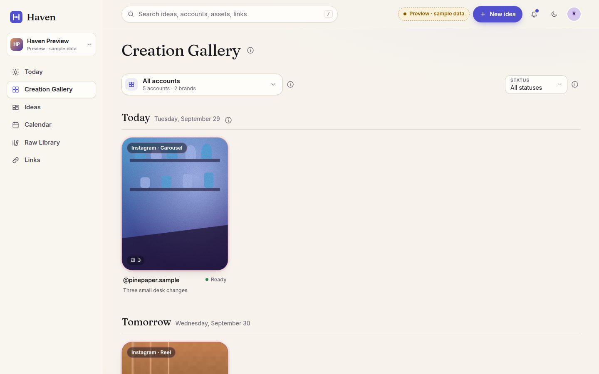 | 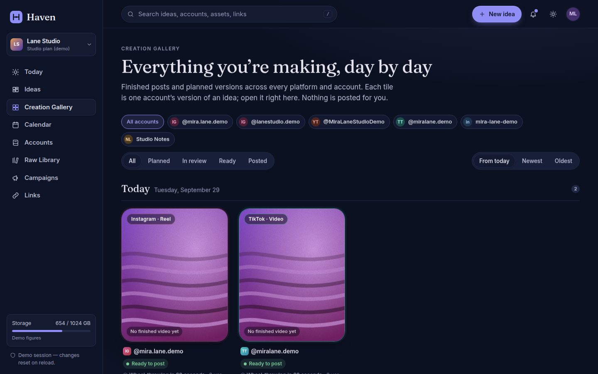 |
| 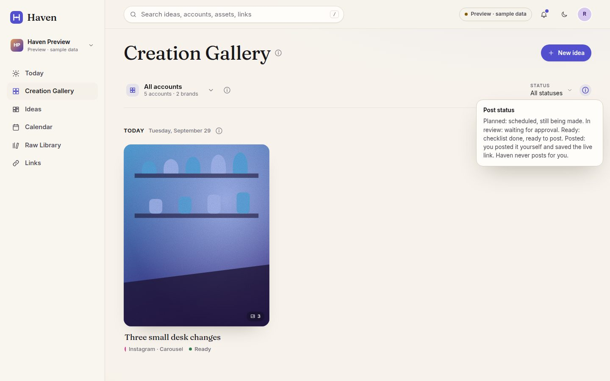 | 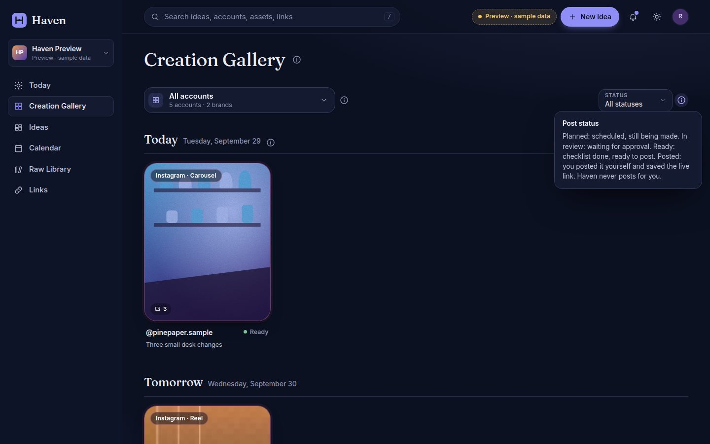 |
| 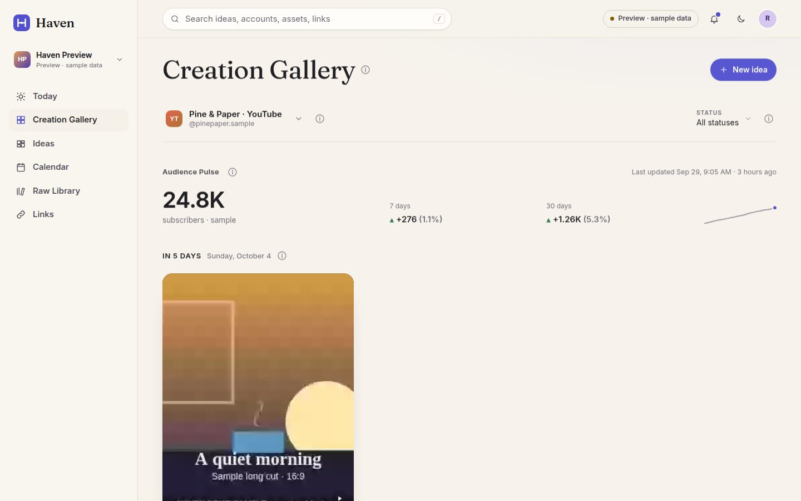 | 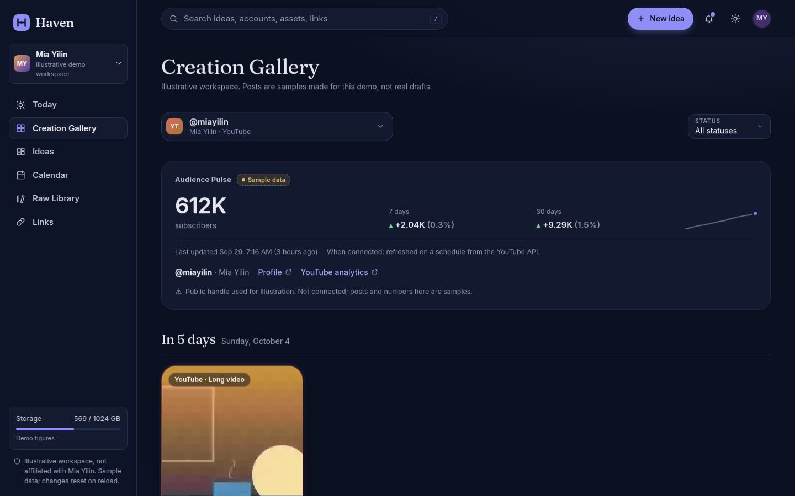 |
| 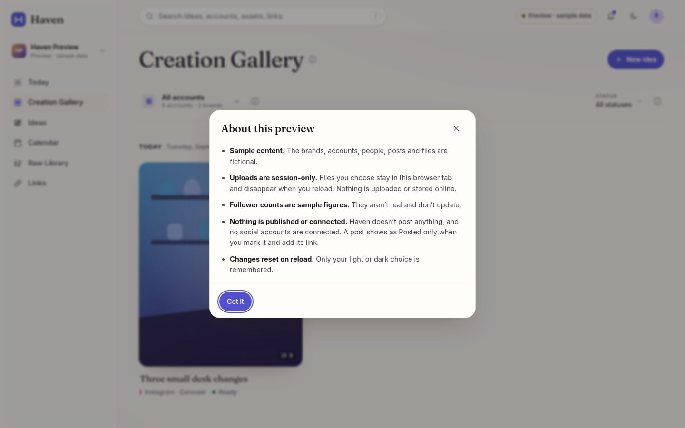 | 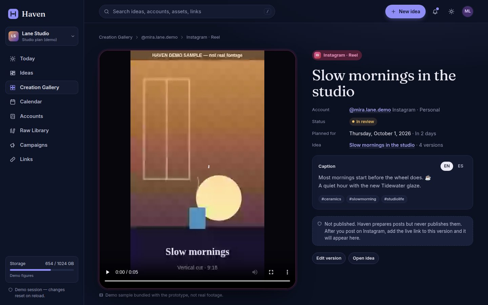 |
| 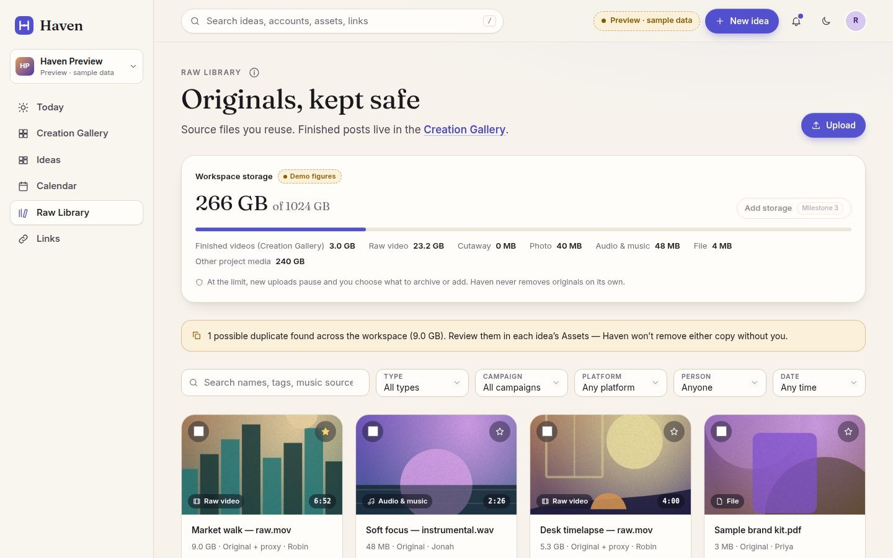 | 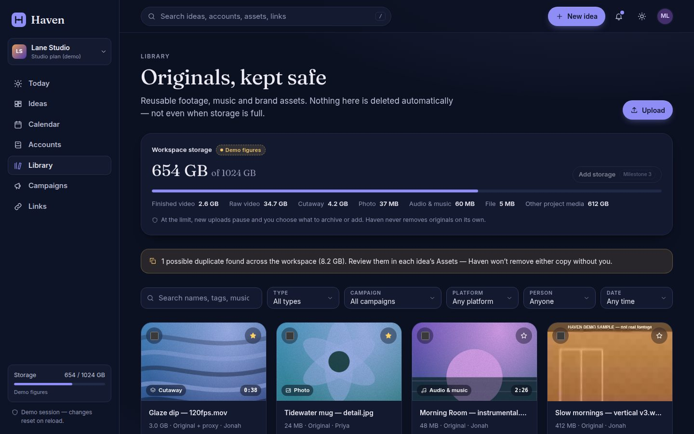 |

| Phone · Gallery | Phone · ⓘ | Phone · One account | Phone · About | Phone · Raw Library |
| --- | --- | --- | --- | --- |
| 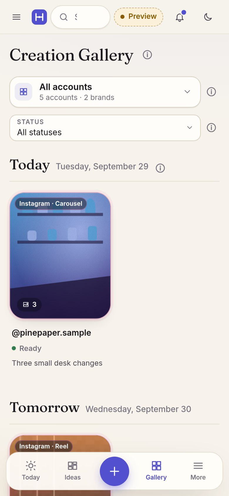 | 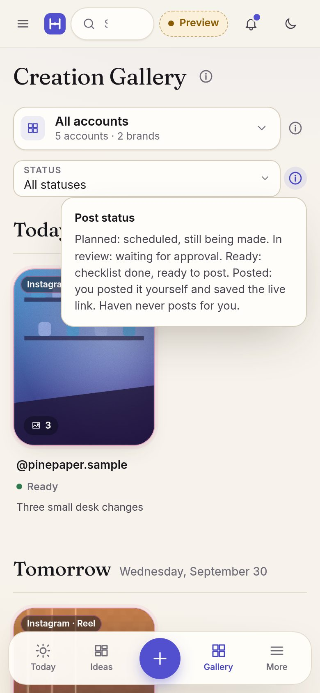 | 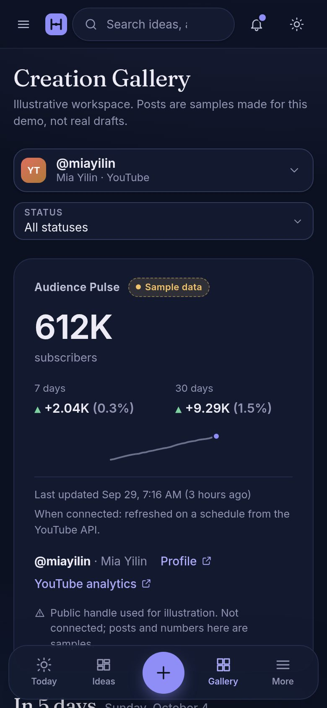 | 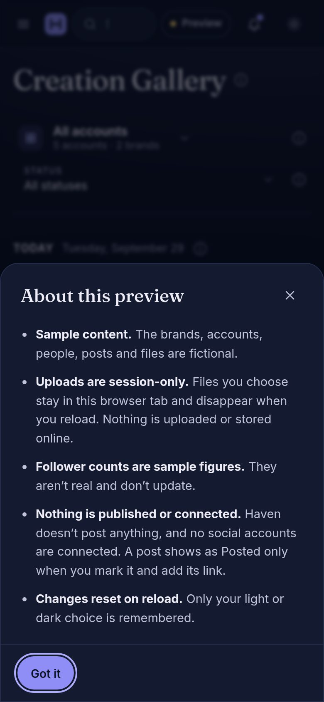 | 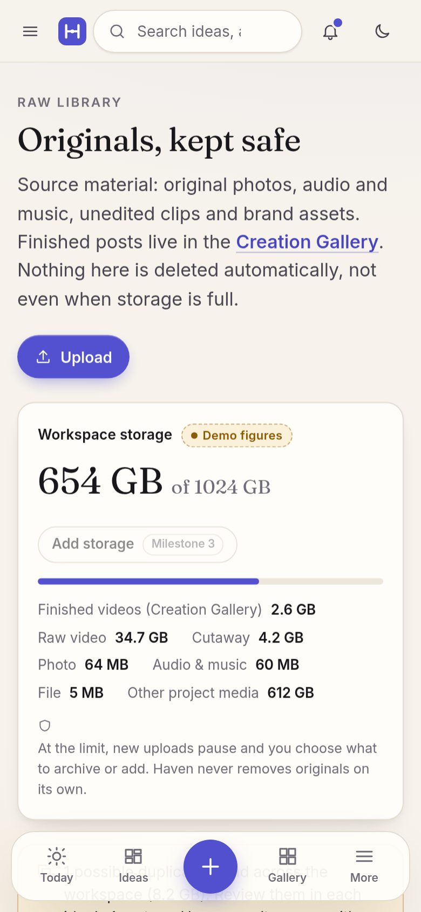 |

## Honest states

- **Uploads** are simulated and session-only. A video chosen from the device plays from a browser-local URL and is labelled *From this device · session only. Not uploaded or stored online.*
- **Sample videos** are labelled *Demo sample bundled with the prototype, not real footage*.
- **Posting**: Haven doesn’t publish. Unposted creations say *Not published*. A version becomes *Posted* only when you paste its live URL; only then does *Open posted video/post* appear.
- **Audience Pulse** figures are marked *sample*, static, and shown as *Out of date* once too old.
- **Downloads, download packages and bundles** produce no files. Storage figures are labelled *Demo figures*; nothing is deleted automatically.
- **Deleting an idea** lists which files are kept (Raw Library originals and files shared with other ideas).
- The **post preview** is labelled approximate.

## Known limitations (by design for Milestone 1)

- No persistence beyond the theme: all edits reset on reload.
- No auth, database, object storage, real uploads/downloads, quota enforcement or platform connections (Milestone 2).
- No review links, version comparison, approvals, ready-to-post bundles, recurring templates or billing (Milestone 3).
- Media is generated artwork and synthetic sample video; the post preview is approximate.
- The bundled samples don’t report a duration, so their seek bar is limited.
- Calendar drag-and-drop needs a mouse; on touch devices, reschedule from the version’s date field.
- Fonts and colours are provisional pending design review.
