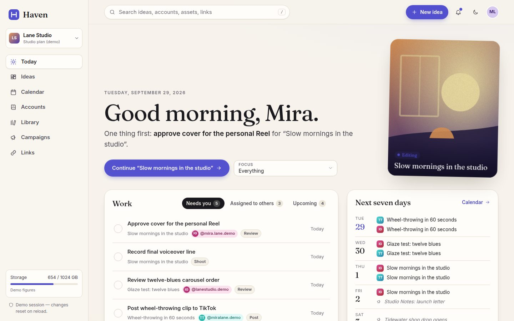
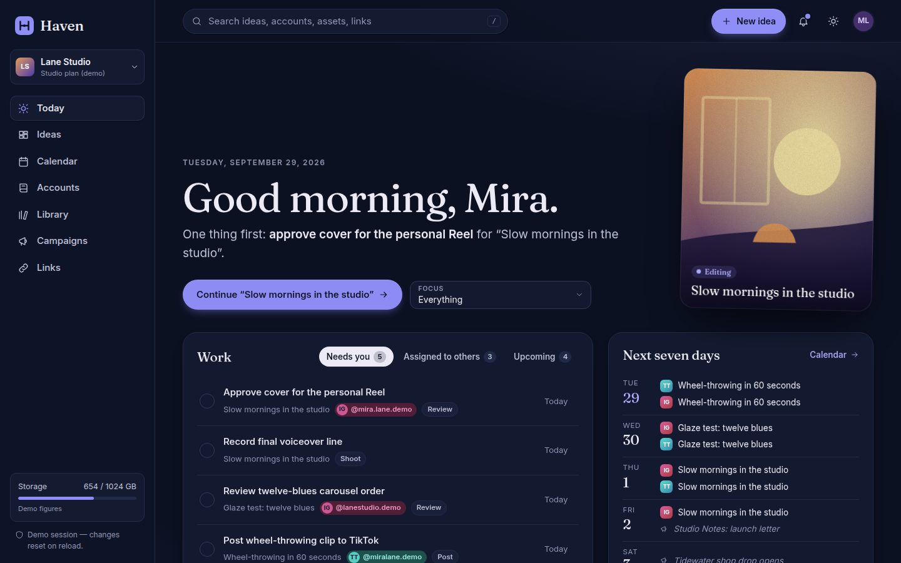
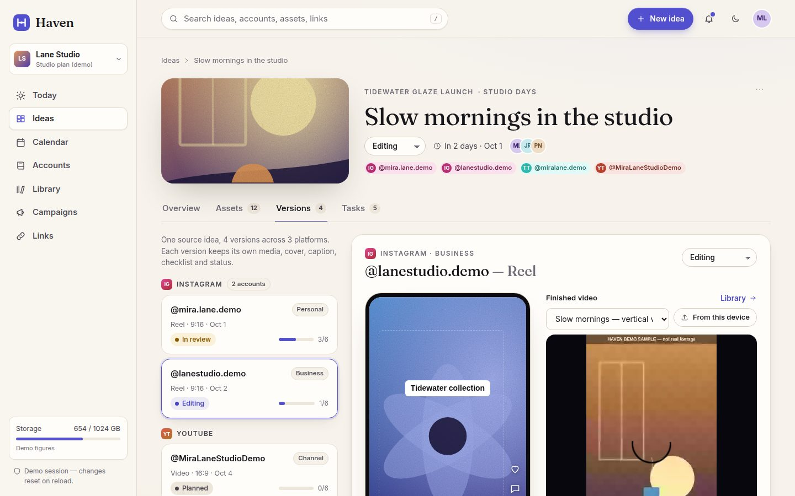
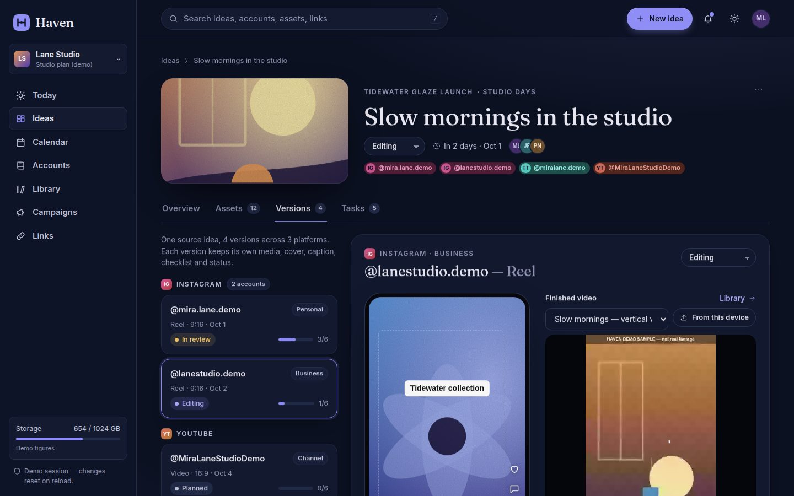
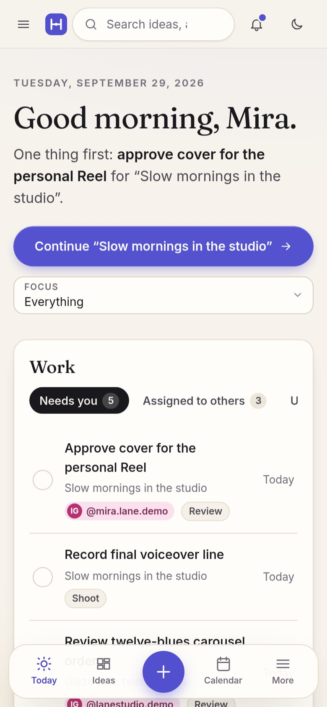
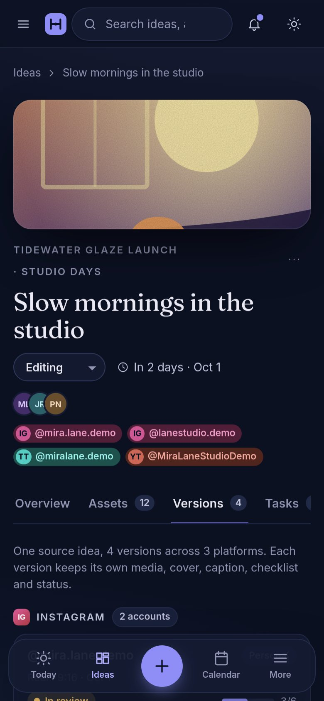
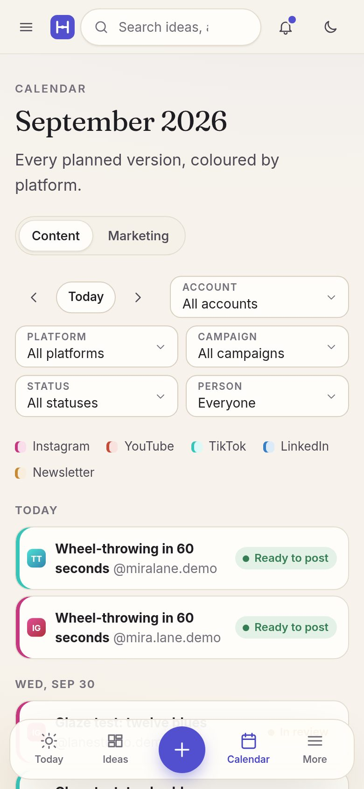

# Haven

A calm, premium daily workspace for creators and their small teams. It takes one idea from capture, through footage, versions for each account, editing handoff and review, to posting prep and reuse.

> **Status: Milestone 1 — reviewable interactive prototype.** No accounts, no database, no uploads, no payments, no platform connections. Every change you make lives in your browser tab and resets on reload. The only thing remembered is your light/dark choice.

Product and design guidance lives in [`Haven — Design and Claude Build Brief.md`](Haven%20%E2%80%94%20Design%20and%20Claude%20Build%20Brief.md).

## Run it

Requires Node 20+ (Node 22 recommended). In GitHub Codespaces the included dev container installs everything.

```bash
npm install
npm run dev          # http://localhost:5173 — hot-reloading dev server
```

| Command | What it does |
| --- | --- |
| `npm run dev` | Dev server on port 5173 |
| `npm run build` | Typecheck + production build to `dist/` |
| `npm run preview` | Serve the production build on port 4173 |
| `npm run typecheck` | TypeScript only |
| `npm test` | Unit tests (Vitest): demo data integrity, reducer rules, date helpers |
| `npm run test:e2e` | Flow checks (Playwright) on desktop and phone against the build |
| `npm run screenshots` | Regenerates review screenshots in `docs/screenshots/` (both themes, desktop + phone) |
| `npm run check` | typecheck → unit tests → build → flow checks |

Playwright needs a Chromium: `npx playwright install chromium` (the dev container does this). If you already have a Chromium binary, set `PLAYWRIGHT_CHROMIUM_EXECUTABLE=/path/to/chrome` instead.

Add `?instant` to any URL to skip the simulated loading states (the automated checks do this).

## Stack

Vite + React 19 + TypeScript + React Router. Plain CSS with design tokens (`src/styles/app.css`) — light and dark are two full token sets, not an inversion. Fonts are self-hosted via Fontsource (Fraunces for display, Inter for UI); both are provisional pending design review.

```
src/
  data/types.ts        Domain model (ideas, versions, accounts, assets, tasks, links…)
  data/demo.ts         Seeded demo workspace — fictional, replaceable, dates relative to today
  state/reducer.ts     All in-memory interactions (pure, unit tested)
  state/store.tsx      React context around the reducer
  state/theme.tsx      Remembered light/dark appearance
  components/          Shell, cover art, post preview, uploader, asset card, primitives
  pages/               Today, Ideas, Idea workspace (4 tabs), Accounts, Calendar, Library, Campaigns, Links
e2e/                   Playwright flow checks + screenshot capture
docs/screenshots/      Review screenshots (light/dark × desktop/phone)
```

## Routes

| Route | Screen |
| --- | --- |
| `/` | **Today** — date, one next action, "Needs you / Assigned to others / Upcoming", next seven days, accounts used today, recently active ideas, focus by account or campaign |
| `/ideas` | **Ideas** — media-led grid; filter by status, campaign, account, text; sort; active/archived |
| `/ideas/:id` | **Idea · Overview** — concept, script, shot list, versions summary, people, references, live links & learning notes |
| `/ideas/:id/assets` | **Idea · Assets** — raw/cutaway/photo/audio/cover, selects, moments, duplicates, music rights, promote to Library, demo uploader |
| `/ideas/:id/versions?v=` | **Idea · Versions** — one row per account, grouped by platform; **finished video picked from the Library (or from this device, session only) with an in-page player**; approximate post preview, cover pick, captions per language, on-screen text plan, checklist, schedule, honest posting |
| `/ideas/:id/tasks` | **Idea · Tasks** — owner, stage, due, per-version tasks, stage progress |
| `/accounts` | **Accounts** — notebook by platform, several accounts per platform, empty platforms, room for more channels, planned-next with account filter, and **Finished videos** with an *All accounts* view plus a filter per account (`?videos=<accountId>`) |
| `/accounts/:id` | **Account** — finished videos for this account with in-page players, profile + native analytics links, sibling accounts on the same platform, planned and published versions, links |
| `/calendar` | **Calendar** — content and marketing perspectives, filters (account, platform, campaign, status, person), legend, drag to reschedule; agenda on phones |
| `/library` | **Library** — in-page players for videos, storage meter, duplicate warning, search + filters (type incl. *Finished video*/brand kit, campaign, platform, person, date), selection → download package |
| `/campaigns` | **Campaigns** — launches, series, sponsorships and their ideas |
| `/links` | **Links** — account pages, native analytics, published posts, affiliate/campaign, brand resources |

## The review path

Follow **“Slow mornings in the studio”** from Today → *Continue* → Versions. It has four versions: **Instagram personal (@mira.lane.demo)**, **Instagram business (@lanestudio.demo)**, **TikTok** and **YouTube** — two platforms plus two accounts on one platform, each with its own cover, caption, checklist and status.

### Finished-video flow

1. **Library** (`/library?kind=final`, or *Type → Finished video*) — videos play in the page. Upload a video from your device and it plays too, labelled *From this device · session only*.
2. **Idea → Versions** — each account's version has a *Finished video* picker listing Library videos, plus *From this device*. The three vertical versions of “Slow mornings” (both Instagram accounts and TikTok) already share **one** Library file; picking the same video for another account adds a reference, never a copy, and the version shows which other accounts use it.
3. **Accounts → Finished videos** — *All accounts* groups everything by idea, then by Library file, listing the platform/account versions that use each video. Filter to one account, or open an account page to see that account's videos with players.

Two small sample videos (`public/demo-media/*.webm`, “HAVEN DEMO SAMPLE — not real footage” burned in) are bundled so the seeded Library has something to play. They are regenerated with `node scripts/make-demo-videos.mjs`.

## Screenshots

All 40 review screenshots (10 screens × light/dark × desktop/phone) are in [`docs/screenshots/`](docs/screenshots/). Regenerate with `npm run screenshots`.

| Light | Dark |
| --- | --- |
|  |  |
|  |  |

| Phone · Today | Phone · Versions | Phone · Calendar agenda |
| --- | --- | --- |
|  |  |  |

## Honest states

The prototype never implies something happened that didn't:

- **Uploads** are simulated; nothing leaves the browser. Progress, pause/resume, an interruption and retry are shown, and results are tagged *Session only*. A **video chosen from the device** gets a browser-local URL so it can play in the page, and is labelled *From this device · session only. Not uploaded or stored online; gone when you reload.*
- **Bundled sample videos** are labelled *Demo sample bundled with the prototype, not real footage*. Seeded clips without a file say *Placeholder only*.
- **Selecting a finished video** for a version doesn't post anything; account pages say *Nothing here is posted to any platform*.
- **Downloads and download packages** show what would be produced but produce no files.
- **Storage** numbers are labelled *Demo figures*. "Add storage" is disabled until billing exists. Nothing is ever deleted automatically.
- **Posting**: Haven doesn't publish. A version becomes *Posted* only when you paste the live URL after posting natively; the link is then recorded in Links.
- **Analytics** links open the platform. Haven doesn't import or display analytics.
- **Accounts** are links only — no sign-in, no connection.
- **Deleting an idea** lists which files are kept (Library originals and files shared with other ideas) and which go with it.
- The **post preview** is labelled approximate.

## Known limitations (by design for Milestone 1)

- No persistence beyond the theme: all edits reset on reload.
- No auth, workspaces, roles, database, object storage, real uploads/downloads, or quota enforcement (Milestone 2).
- No review links, timestamped review comments, version comparison, approvals, ready-to-post bundles, recurring templates, or billing (Milestone 3). The History idea tab is folded into Overview's "Live links & learning".
- Media is generated artwork, not real footage; the post preview is a rough frame per platform, not the platform's renderer.
- Device videos last only for the open tab (browser object URLs). Library sizes are demo figures, not the sample files' real size. The bundled samples are recorded in the browser and don't report a duration, so their seek bar is limited.
- Calendar drag-and-drop uses native HTML drag events (mouse); on touch devices, reschedule from the version's date field.
- Captions, tags and schedule are editable; concept, script, references and on-screen text are read-only in this prototype.
- Fonts and colours are provisional pending design review.
