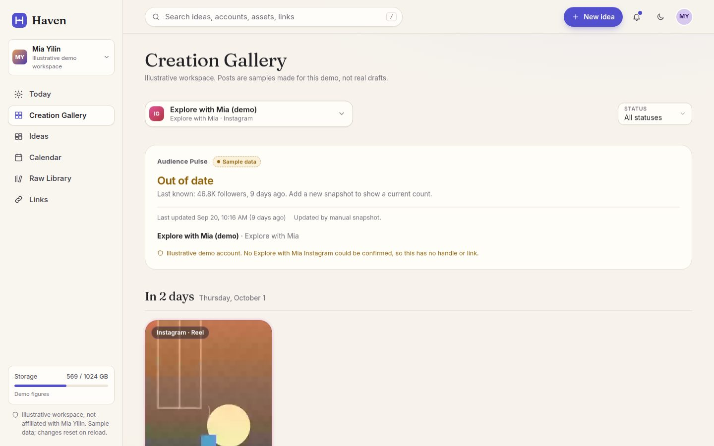
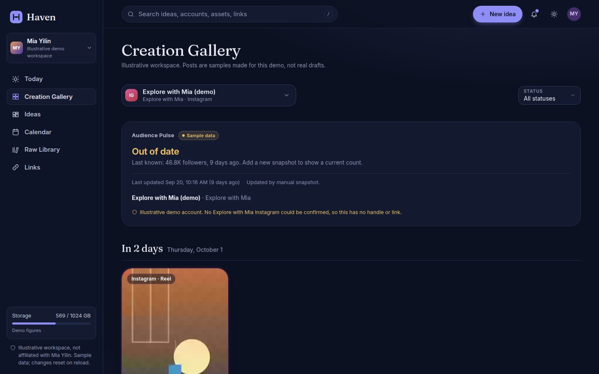
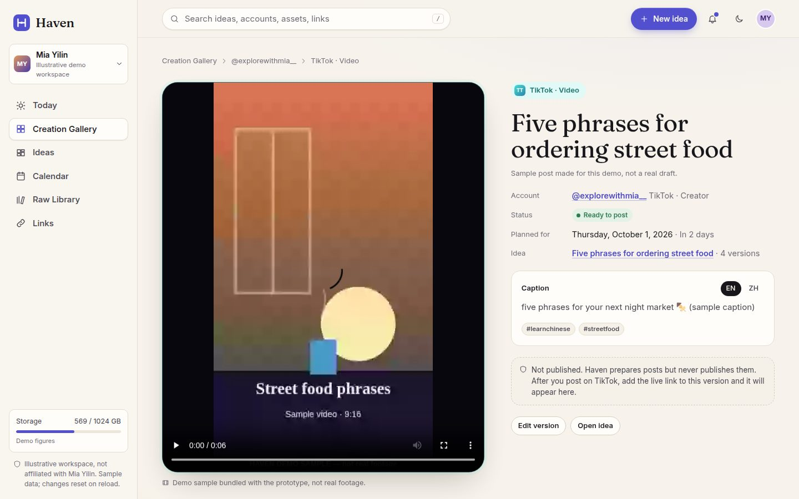
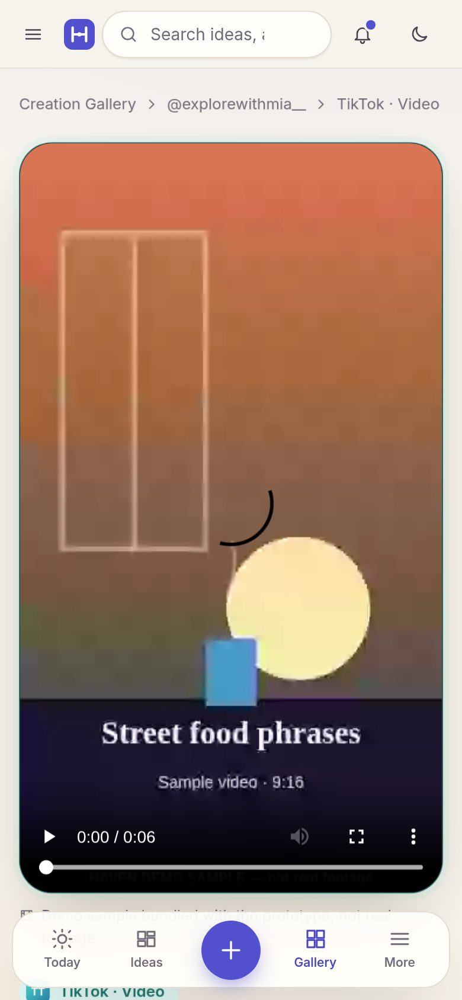
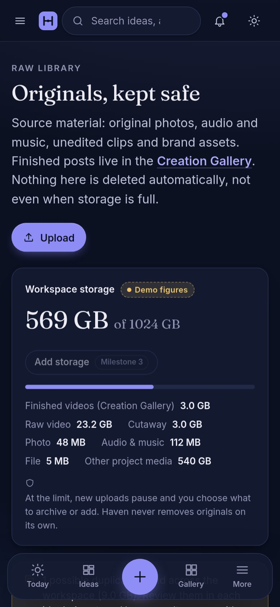

# Haven

A calm, premium daily workspace for creators and their small teams. It takes one idea from capture, through footage, versions for each account, editing handoff and review, to posting prep and reuse.

> **Status: Milestone 1 — reviewable interactive prototype.** No accounts, no database, no uploads, no payments, no platform connections. Every change you make lives in your browser tab and resets on reload. The only thing remembered is your light/dark choice.

Product and design guidance lives in [`Haven — Design and Claude Build Brief.md`](Haven%20%E2%80%94%20Design%20and%20Claude%20Build%20Brief.md).

## Run it

Requires Node 20+ (Node 22 recommended). In GitHub Codespaces the included dev container installs everything.

```bash
npm install
npm run dev          # http://localhost:5173 — hot-reloading dev server
```

| Command | What it does |
| --- | --- |
| `npm run dev` | Dev server on port 5173 |
| `npm run build` | Typecheck + production build to `dist/` |
| `npm run preview` | Serve the production build on port 4173 |
| `npm run typecheck` | TypeScript only |
| `npm test` | Unit tests (Vitest): demo data integrity, reducer rules, date helpers |
| `npm run test:e2e` | Flow checks (Playwright) on desktop and phone against the build |
| `npm run screenshots` | Regenerates review screenshots in `docs/screenshots/` (both themes, desktop + phone) |
| `npm run check` | typecheck → unit tests → build → flow checks |

Playwright needs a Chromium: `npx playwright install chromium` (the dev container does this). If you already have a Chromium binary, set `PLAYWRIGHT_CHROMIUM_EXECUTABLE=/path/to/chrome` instead.

Add `?instant` to any URL to skip the simulated loading states (the automated checks do this).

## Stack

Vite + React 19 + TypeScript + React Router. Plain CSS with design tokens (`src/styles/app.css`) — light and dark are two full token sets, not an inversion. Fonts are self-hosted via Fontsource (Fraunces for display, Inter for UI); both are provisional pending design review.

```
src/
  data/types.ts        Domain model (ideas, versions, accounts, assets, tasks, links…)
  data/demo.ts         Seeded demo workspace — fictional, replaceable, dates relative to today
  state/reducer.ts     All in-memory interactions (pure, unit tested)
  state/store.tsx      React context around the reducer
  state/theme.tsx      Remembered light/dark appearance
  components/          Shell, cover art, post preview, uploader, asset card, primitives
  lib/creations.ts     Creation Gallery labels ("Instagram · Reel"), day grouping (unit tested)
  lib/audience.ts      Audience Pulse maths: freshness, 7/30-day change, trend (unit tested)
  pages/               Today, Ideas, Idea workspace (4 tabs), Creation Gallery, Calendar, Raw Library, Campaigns, Links
e2e/                   Playwright flow checks + screenshot capture
docs/screenshots/      Review screenshots (light/dark × desktop/phone)
```

## Demo workspace (illustrative)

The seeded workspace uses creator **Mia Yilin** and her two brands, **Mia Yilin** and **Explore with Mia**, to show a real multi-account setup. It is **not affiliated with or endorsed by Mia Yilin**. Every post, caption, file, task, teammate and audience number is a **sample made for this demo**, not her real drafts, media or figures. Artwork is generated and the videos are original synthetic samples.

| Brand | Account | Status in the demo |
| --- | --- | --- |
| Mia Yilin | YouTube `@miayilin` | Public handle, linked to the public profile |
| Mia Yilin | Instagram `@mia_yilin_` | Public handle as listed on creator-stats sites; not confirmed from the profile |
| Mia Yilin | TikTok `@mia_yilin` | Public handle |
| Mia Yilin | LinkedIn | **Illustrative demo account**: no handle, no link |
| Explore with Mia | YouTube `@explorewith_mia` | Public handle |
| Explore with Mia | Instagram | **Illustrative demo account**: no confirmed handle, so no handle or link |
| Explore with Mia | TikTok `@explorewithmia__` | Public handle |

The four sample videos in `public/demo-media/` (“HAVEN DEMO SAMPLE — not real footage” burned in) are regenerated with `node scripts/make-demo-videos.mjs`.

Public handles were identified from search results. The profile pages couldn't be opened from the build environment, so they weren't checked directly. Nothing is connected to any platform.

## Routes

| Route | Screen |
| --- | --- |
| `/gallery` | **Creation Gallery**, the account home. One compact **account selector** (All accounts, or one account grouped by brand), a status filter, an **Audience Pulse** for the selected account, then finished and planned posts by day. Tiles show a rounded cover or playable video, a platform-coloured border, a top label (“Instagram · Reel”, “YouTube · Short”, “YouTube · Long video”, “Instagram · Carousel”), the account, status and parent idea. `?account=<id>` selects an account. |
| `/gallery/:versionId` | **Opened creation.** Plays the finished video or pages through the photos inside Haven; shows account, caption, date, status, related idea and its other versions. **Open posted video/post** appears only when the version is Posted with a saved live URL. |
| `/` | **Today**: one next action, task groups, next seven days, accounts used today, recent ideas |
| `/ideas`, `/ideas/:id[/assets|/versions|/tasks]` | **Ideas** and the **Idea workspace**; the Versions tab holds the finished-video picker |
| `/calendar` | Content and marketing perspectives, filters, drag to reschedule; agenda on phones |
| `/library` | **Raw Library**: source files only (original photos, audio/music, unedited clips, brand assets). Finished posts are never listed here. |
| `/links`, `/campaigns` | Saved links; campaigns (reachable from ideas) |
| `/accounts`, `/accounts/:id` | Redirect to the Creation Gallery (and its account selector) |

## The review path

1. **Creation Gallery**: *All accounts* shows everything together. Pick **@miayilin** in the selector for its Audience Pulse and posts, then **Explore with Mia (demo)** to see an out-of-date pulse.
2. Open a tile to play it inside Haven. Open **Quiet study spots** to see the *Open posted video* button on a posted sample.
3. From Today, **Continue “Five phrases for ordering street food”** → Versions. One finished file serves four versions across TikTok, Instagram (both brands) and YouTube (a Short).
4. **Raw Library** holds only source files.

## Audience Pulse

Each account shows its follower/subscriber count, the change over 7 and 30 days, a small 30-day trend, and a *Last updated* time. In the demo every count is **sample data**, labelled as such, and rendered statically; nothing animates as if live.

The data is structured for real use later (`src/data/types.ts`, `src/lib/audience.ts`):

- `AudienceSeries` holds timestamped `snapshots` per account and a `source`: `platform-api` (periodic refresh from an authorized platform API, with a refresh interval) or `manual` (snapshots entered by the creator for accounts that can't connect). Demo series are `sample` with the update method they would use.
- `staleAfterHours` sets how old a count may be. Past that, the pulse shows **Out of date** with the last known figure and its age, **never as the current count**, and hides the 7/30-day change.
- 7- and 30-day change compares the latest snapshot with the one at or before the start of the window. With too little history it says so rather than estimating.

## Screenshots

All 40 review screenshots (10 screens × light/dark × desktop/phone) are in [`docs/screenshots/`](docs/screenshots/). Regenerate with `npm run screenshots`.

| Light | Dark |
| --- | --- |
|  |  |
|  |  |
|  |  |
|  |  |
|  |  |

| Phone · All accounts | Phone · One account | Phone · Opened creation | Phone · Raw Library |
| --- | --- | --- | --- |
|  |  |  |  |

## Honest states

The prototype never implies something happened that didn't:

- **Uploads** are simulated; nothing leaves the browser. Progress, pause/resume, an interruption and retry are shown, and results are tagged *Session only*. A **video chosen from the device** gets a browser-local URL so it can play in the page, and is labelled *From this device · session only. Not uploaded or stored online; gone when you reload.*
- **Bundled sample videos** are labelled *Demo sample bundled with the prototype, not real footage*. Seeded clips without a file say *Placeholder only*.
- **Selecting a finished video** doesn't post anything. Unposted creations say *Not published. Haven prepares posts but never publishes them.* The *Open posted video/post* button appears only for versions marked Posted with a live URL the creator saved.
- **Downloads and download packages** show what would be produced but produce no files.
- **Storage** numbers are labelled *Demo figures*. "Add storage" is disabled until billing exists. Nothing is ever deleted automatically.
- **Posting**: Haven doesn't publish. A version becomes *Posted* only when you paste the live URL after posting natively; the link is then recorded in Links.
- **Audience Pulse** numbers are sample data, labelled on every pulse, static, and shown as *Out of date* once older than the series allows. Native analytics links open the platform.
- **Illustrative workspace**: the sidebar and gallery say the workspace isn't affiliated with Mia Yilin and that posts are samples. Opened creations say *Sample post made for this demo, not a real draft.* Sample posted links point at example.com.
- **Accounts** are links only — no sign-in, no connection. Illustrative accounts have no handle or link.
- **Deleting an idea** lists which files are kept (Raw Library originals and files shared with other ideas) and which go with it.
- The **post preview** is labelled approximate.

## Known limitations (by design for Milestone 1)

- No persistence beyond the theme: all edits reset on reload.
- No auth, workspaces, roles, database, object storage, real uploads/downloads, or quota enforcement (Milestone 2).
- No review links, timestamped review comments, version comparison, approvals, ready-to-post bundles, recurring templates, or billing (Milestone 3). The History idea tab is folded into Overview's "Live links & learning".
- Media is generated artwork, not real footage; the post preview is a rough frame per platform, not the platform's renderer.
- Device videos last only for the open tab (browser object URLs). File sizes are demo figures, not the sample files' real size. The bundled samples are recorded in the browser and don't report a duration, so their seek bar is limited.
- Calendar drag-and-drop uses native HTML drag events (mouse); on touch devices, reschedule from the version's date field.
- Captions, tags and schedule are editable; concept, script, references and on-screen text are read-only in this prototype.
- Fonts and colours are provisional pending design review.
